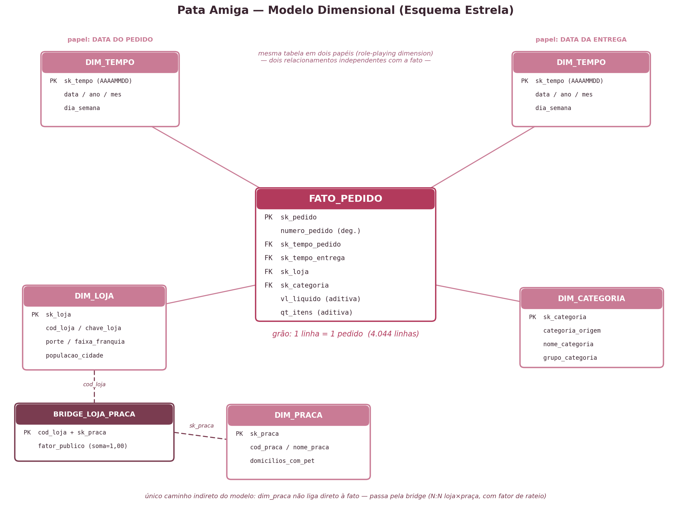

# Pata Amiga — Modelo Dimensional e Análise de Dados

> Mini-Projeto Avaliativo — Análise de Dados com Python [T1] — Módulo 2 

Projeto de modelagem dimensional (esquema estrela) em PostgreSQL para a rede
catarinense de pet shops **Pata Amiga**, respondendo cinco perguntas de
negócio sobre entrega, faturamento, canal de venda, praça de atendimento e
expansão.

## Sumário

- [Contextualização](#contextualização)
- [Diagnóstico da origem](#diagnóstico-da-origem)
- [Como reproduzir o banco](#como-reproduzir-o-banco)
- [O modelo dimensional](#o-modelo-dimensional)
- [Decisões de tratamento](#decisões-de-tratamento)
- [As cinco respostas](#as-cinco-respostas)
- [Vídeo](#vídeo)

## Contextualização

A Pata Amiga é uma rede catarinense de pet shops, com 32 lojas espalhadas
pelo estado. Em setembro de 2023 a rede unificou a operação de pedidos com
entrega (app, site, telefone, WhatsApp e loja física). Em sete meses foram
4.044 pedidos, registrados em três sistemas que não conversam entre si: a
plataforma de e-commerce, o cadastro de lojas do franchising e a planilha de
praças de atendimento do time de expansão.

## Diagnóstico da origem

Rodando `sql/01-carga-staging.sql` e conferindo com `sql/00-conferencia.sql`:

| Tabela | Linhas |
|---|---|
| `stg_pedido` | 4.044 |
| `stg_loja` | 32 |
| `stg_loja_praca` | 48 |

**Grafias distintas na `stg_pedido` (texto cru, sem tratamento):**

| Coluna | Grafias distintas |
|---|---|
| `CategoriaProduto` | 37 (para apenas 7 categorias reais) |
| `Loja-Nome` | 128 (para 32 lojas reais) |
| `HouveDesconto` | 17 (para 3 valores possíveis: Sim / Não / Não Informado) |
| `CanalPedido` | 20 (para 5 canais possíveis) |

Exemplos do que está por trás desses números:

- `CategoriaProduto`: `RACAO`, `RAÇÃO`, `Rac.`, `Racao`, `racao`, `Ração`, além da pegadinha `Racao Medicamentosa` / `Ração Medicamentosa`, que **não é ração — é medicamento**.
- `Loja-Nome`: a mesma loja de Blumenau aparece como ` Pata Amiga Blumenau Centro` (espaço sobrando), `PATA AMIGA BLUMENAU CENTRO`, `Pata Amiga Blumenal Centro` (erro de digitação), `Pata Amiga Blumenau Centro/SC` e `pata amiga blumenau centro`.
- `HouveDesconto`: `S`, `SIM`, `Sim`, `sim`, `1`, `V`, `X`, `true`, e o próprio vazio (`''`), todos caindo em **Sim** ou **Não**.
- `CanalPedido`: `APP`, `App`, `App Pata Amiga`, `app` (todos App); `WHATSAPP`, `WhatsApp`, `Whatsapp`, `whatsapp` (todos WhatsApp, cuidado: "WHATSAPP" contém "APP").

**Completude:**

| O que falta | Quantidade | % |
|---|---|---|
| Pedidos sem `Cod Loja` preenchido (resolvido pelo nome) | 1.575 | ~39% |
| Pedidos sem `Loja-Nome` (vão para a linha -1) | 3 | ~0,07% |
| Marcos em branco — `Dt Separacao Estoque` | 1.077 | ~26,6% |
| Marcos em branco — `DtNotaFiscal` | 1.338 | ~33,1% |
| Marcos em branco — `Dt_Despacho_Transportadora` | 1.665 | ~41,2% |
| Marcos em branco — `DtEntregaCliente` | 1.953 | ~48,3% |

Marco em branco não é erro de digitação: é processo em aberto (o pedido ainda não passou por aquela etapa até o fim da janela de 7 meses). Por isso viram `NULL` nas colunas de dias, nunca `0`.

A máscara de data americana (`TO_TIMESTAMP(..., 'MM/DD/YYYY HH12:MI AM')`) converte as 4.044 linhas de `DtHoraPedido` sem erro — confirma que a origem realmente veio no formato americano (mês antes do dia). Tentar `'DD/MM/YYYY'` lança erro assim que aparece um mês > 12.

## Como reproduzir o banco

Pré-requisito: PostgreSQL 16. Rode os scripts de `sql/` **nesta ordem**, com `psql`:

```bash
psql -U postgres -d postgres -f sql/01-carga-staging.sql       
psql -U postgres -d dw_pata_amiga -f sql/02-dimensoes-prontas.sql  
psql -U postgres -d dw_pata_amiga -f sql/03-dimensoes-tratamento.sql  
psql -U postgres -d dw_pata_amiga -f sql/04-fato-pedido.sql     
psql -U postgres -d dw_pata_amiga -f sql/05-perguntas-negocio.sql  
```

`sql/00-conferencia.sql` não faz parte da carga — é a bateria de conferência
(não altera dado nenhum) para rodar depois de cada etapa acima e comparar com
os números esperados.

## O modelo dimensional



Um fato, quatro dimensões, uma ponte:

- **`fato_pedido`** — grão: **1 linha = 1 pedido** (4.044 linhas).
- **`dim_tempo`** — ligada **duas vezes** à fato (`sk_tempo_pedido` e `sk_tempo_entrega`): é a mesma tabela em dois papéis (*role-playing dimension*). `sk_tempo_entrega = -1` quando a entrega ainda não aconteceu.
- **`dim_loja`** e **`dim_categoria`** — ligadas direto à fato.
- **`dim_praca`** — **não** liga direto à fato: liga por `bridge_loja_praca`, que resolve a relação N:N (uma loja atende mais de uma praça) e carrega o `fator_publico` usado para ratear o faturamento na P4.
- `numero_pedido` é uma dimensão degenerada (fica na própria fato, sem tabela própria, porque não tem atributo pendurado).
- Toda dimensão tem a linha `-1 = "Nao Informado"`: nenhuma FK da fato fica nula.

## Decisões de tratamento

- **Datas**: `DtHoraPedido` e `DtHoraIntegracaoERP` vêm no formato americano com AM/PM (`TO_TIMESTAMP(coluna, 'MM/DD/YYYY HH12:MI AM')`); os quatro marcos do processo de entrega já vêm em ISO (`coluna::date`). Usar `'DD/MM/YYYY'` na data do pedido faria o PostgreSQL lançar erro no primeiro mês > 12 — foi assim que a máscara errada foi descartada.
- **Números**: `''`/`'-'` viram `NULL` (nunca `0`) em `vl_liquido` e `qt_itens`. `vl_liquido` usa a expressão do enunciado, que trata em uma passada `'R$ 1.850,00'`, `'1850.00'` e `'1.200'` na mesma coluna.
- **Categoria**: de-para de 37 grafias em 7 categorias, com o `CASE` testado nesta ordem — `MED → PETISC → RA → HIG → BRINQ → ACESS → SERV` — porque `MED` precisa vir antes de `RA` (senão "Racao Medicamentosa" vira Ração em vez de Medicamento). Comparação sempre em `UPPER(TRANSLATE(...))` para não depender de acento/caixa.
- **Nome da loja**: primeiro um `REPLACE` mecânico tira `/SC` e espaço duplo; depois um `CASE` escrito à mão resolve as 3 grafias que sobram — `Blumenal Centro` (erro de digitação) → Blumenau Centro, `Floripa Norte` (apelido) → Florianópolis Norte, `Jgua do Sul` (abreviação) → Jaraguá do Sul. A padronização acontece **antes** do lookup contra `dim_loja.chave_loja` — nunca depois.
- **Desconto e canal**: não viram dimensão (poucos valores, nada pendurado neles) — ficam na própria fato, padronizados uma única vez no `04-fato-pedido.sql`. No canal, `WHATS` é testado antes de `APP` (senão "WHATSAPP" cairia dentro de App); confirmado que os 414 pedidos de WhatsApp aparecem corretamente na fato.
- **Sem subconsulta na carga**: nenhum `INSERT` das dimensões ou da fato usa subconsulta — toda resolução é por `JOIN`/`LEFT JOIN` contra a grafia (ou o código) já guardado na dimensão. Subconsulta só aparece nas 5 perguntas de negócio (para trazer o total da rede como denominador).

## As cinco respostas

**P1 — Onde está o gargalo da entrega?**
O tempo médio do pedido até a entrega é de **7,9 a 8,0 dias** em lojas Grande/Média e **15,2 dias** em lojas Pequenas — quase o dobro. O intervalo mais lento em todos os portes é **Nota → Despacho** (3,3 dias em Grande/Média, 8,5 dias em Pequena): o gargalo não é a entrega em si (Despacho → Entrega fica em ~2 a 3 dias em todo porte), é o tempo entre emitir a nota fiscal e despachar para a transportadora — e esse gargalo é bem mais grave nas lojas Pequenas.

**P2 — Qual categoria concentra o faturamento?**
**Ração** sozinha responde por **60,0%** do faturamento da rede (R$ 1.076.202,55), seguida de Medicamento (17,1%) e Petisco (7,2%) — as três primeiras já somam quase 85% do total. Ração é a categoria campeã nos três portes de loja (Grande, Média e Pequena), sem exceção.

**P3 — O desconto funciona igual em todo canal?**
Não. Em todos os canais o pedido COM desconto tem ticket médio bem maior que SEM desconto (ex.: App R$ 488 com desconto vs. R$ 168 sem; WhatsApp R$ 514 vs. R$ 179) — mas a diferença relativa varia por canal, o que sugere que o desconto está sendo usado como alavanca de ticket de forma desigual entre canais, e não como uma política uniforme. Em faturamento, App lidera com 30,8% do total, seguido de Site (25,1%) e Loja Física (20,1%); WhatsApp e Telefone somam só 17,4% juntos.

**P4 — Qual praça de atendimento concentra o faturamento?**
Rateando o faturamento de cada loja pelo `fator_publico` (a soma bate exatamente com o total da rede — diferença de R$ 0), a praça **Vale do Itajaí** concentra o maior faturamento rateado (R$ 633.746, ~35% do total) e também lidera em intensidade — R$ 4.282 rateados por mil domicílios com pet, quase o dobro da segunda colocada. Isso já era esperado em parte, por ser a praça com mais domicílios com pet (148 mil) e mais lojas. O dado mais interessante aparece ao cruzar com domicílios: a praça **Litoral Sul**, mesmo tendo só 58 mil domicílios com pet (a 6ª maior), fica em **2º lugar em intensidade** (R$ 2.363/mil domicílios) — à frente de praças bem maiores como Grande Florianópolis (132 mil domicílios, R$ 2.148/mil) e Norte Industrial (96 mil domicílios, R$ 1.827/mil). Ou seja, Litoral Sul converte sua base de domicílios em faturamento proporcionalmente melhor do que praças com muito mais público.

**P5 — Onde abrir a próxima loja, e o que os dados não permitem afirmar?**
Ranqueando por itens vendidos por mil habitantes (não em valor absoluto), as lojas de **cidades pequenas do Vale do Itajaí e Alto Vale** aparecem no topo — Rio dos Cedros (41,9 itens/mil hab.), Presidente Getúlio (34,8) e Ibirama (32,1) — sinal de que cidades menores, mesmo com faturamento absoluto baixo, têm demanda per capita alta e ainda estão pouco saturadas; a recomendação é priorizar praças com esse perfil (cidades de 15 a 30 mil habitantes na região do Vale do Itajaí/Alto Vale) para a próxima loja, mas atentando ao tempo de entrega dessas lojas (14 a 16 dias, bem acima da média de ~8 dias das lojas maiores) — a expansão nessas cidades exige resolver antes o gargalo logístico da P1. O faturamento por faixa de franquia ATUAL mostra Ouro concentrando 56,4% do total, mas **isso não responde "quanto veio de lojas que já eram Ouro na data do pedido"**: `faixa_franquia` no cadastro é a foto de hoje — o histórico foi sobrescrito, então uma loja que subiu de Prata para Ouro entre setembro/2023 e março/2024 tem todo o seu faturamento do período contado como se sempre tivesse sido Ouro. Por fim, o que os dados deixam de fora: **3 pedidos** sem loja identificada, **1.953 entregas** (48%) ainda não concluídas até o fim da janela, **257 pedidos** com itens em branco e **121** com valor em branco — nenhum desses casos foi descartado (todos entram nas contagens gerais via linha -1 ou `NULL`), mas eles limitam a precisão de qualquer média calculada sobre o período.

